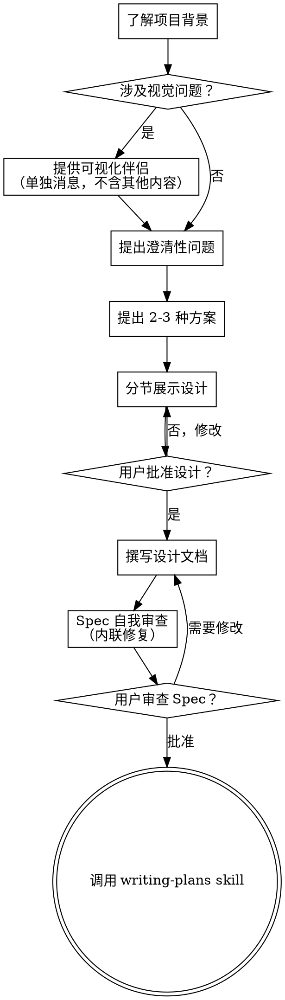

# Brainstorming Ideas Into Designs

通过自然协作对话，将想法转化为完整的设计方案和规格。

开始时先了解当前项目背景，然后一次问一个问题来完善想法。完全理解要构建的内容后，展示设计并获得用户批准。

<HARD-GATE>
在展示设计并获得用户批准之前，**不要**调用任何实现类 skill，不要写任何代码，不要搭建项目脚手架，也不要采取任何实现行动。无论项目看起来多简单，这条规则适用于所有项目。
</HARD-GATE>

## 反模式："这太简单了不需要设计"

每个项目都要经过这个流程。Todo 列表、单一功能工具、配置变更——全都是。"简单"项目恰恰是最容易因为未经审视的假设而浪费工作的地方。设计可以很短（真正简单的项目几句话就够），但必须展示并获得批准。

## 清单

每个项目必须按顺序完成以下步骤：

1. **了解项目背景** — 查看文件、文档、最近提交记录
2. **提供可视化伴侣**（如果主题涉及视觉问题）——单独发一条消息，不与澄清问题合并。详见下方 Visual Companion 部分。
3. **提出澄清性问题** — 一次问一个，理解目的/约束/成功标准
4. **提出 2-3 种方案** — 附上权衡分析和你的推荐
5. **展示设计** — 按复杂度分节展示，每节获得用户确认
6. **撰写设计文档** — 保存到 `docs/superpowers/specs/YYYY-MM-DD-<topic>-design.md` 并提交 git
7. **Spec 自我审查** — 快速检查占位符、矛盾、歧义、范围（见下方）
8. **用户审查书面 Spec** — 请用户审查 spec 文件后再继续
9. **过渡到实施** — 调用 `writing-plans` skill 创建实施计划

## 流程图

**最终状态是调用 writing-plans。** 之后不要调用 frontend-design、mcp-builder 或任何其他实现类 skill。Brainstorming 之后唯一可以调用的 skill 是 `writing-plans`。

## 流程详解

### 理解想法

- 先检查当前项目状态（文件、文档、最近提交）
- 在问详细问题之前，先评估范围：如果请求涉及多个独立子系统（例如"建一个包含聊天、文件存储、计费和分析的平台"），立即标记这一点。在分解一个需要先拆分的项目之前，不要花时间完善细节。
- 如果项目太大无法用单一 spec 覆盖，帮助用户拆分为子项目：有哪些独立部分？它们如何关联？应该按什么顺序构建？然后对第一个子项目进行正常的设计流程。每个子项目有自己独立的 spec → 计划 → 实施循环。
- 对于规模适当的项目，一次问一个问题来完善想法
- 尽量用选择题而非开放式问题
- 每条消息只问一个问题——如果一个主题需要更多探索，拆成多个问题
- 聚焦于理解：目的、约束、成功标准

### 探索方案

- 提出 2-3 种不同方案，附上权衡
- 对话式呈现选项，说明推荐理由
- 先说推荐选项和原因

### 展示设计

- 确信理解要构建的内容后，展示设计
- 每节按复杂度调整长度：简单的几句话，复杂的上限 200-300 字
- 每节之后问"到这里看起来对吗"
- 覆盖：架构、组件、数据流、错误处理、测试
- 准备好在内容不合理时回去澄清

### 隔离和清晰的设计原则

- 将系统拆分为更小的单元，每个单元有单一明确的目的，通过明确定义的接口通信，可以独立理解和测试
- 对于每个单元，都能回答：它做什么，你怎么用它，它依赖什么？
- 能否在不阅读内部实现的情况下理解一个单元的用途？能否在不影响消费者的情况下修改内部实现？如果不能，边界需要调整。
- 更小、边界更清晰的单元也更便于你工作——你能在一次可理解的代码量内更好地推理，编辑也更可靠。当一个文件变大，往往是它做得太多的信号。

### 在现有代码库中工作

- 在提出变更之前先探索当前结构。遵循现有模式。
- 如果现有代码有问题影响当前工作（如一个变得太大的文件、不清晰的边界、纠缠的职责），将针对性改进作为设计的一部分——就像一个好的开发者在工作时改进代码一样。
- 不要提议无关的重构。聚焦于服务当前目标的内容。

## 设计之后

### 文档

- 将经验证的设计（spec）写入 `docs/superpowers/specs/YYYY-MM-DD-<topic>-design.md`
  - （用户对 spec 位置的偏好优先于此默认路径）
- 使用 elements-of-style:writing-clearly-and-concisely skill（如果可用）
- 将设计文档提交到 git

### Spec 自我审查

写完 spec 文档后，用新眼光审视：

1. **占位符扫描：** 有"TBD"、"TODO"、不完整章节或模糊需求吗？修复它们。
2. **内部一致性：** 章节之间有矛盾吗？架构描述与功能描述匹配吗？
3. **范围检查：** 这个 spec Focused 到可以用单一实施计划实现吗？是否需要拆解？
4. **歧义检查：** 任何需求能被两种方式理解吗？如果能，选择一个并明确说明。

内联修复任何问题。不需要重新审查——修复后继续。

### 用户审查门槛

Spec 审查循环通过后，在继续之前请用户审查书面 spec：

> "Spec 已写完并提交到 `<path>`。请审查，如果想在开始写实施计划之前做任何修改，告诉我。"

等待用户响应。如果用户要求修改，做修改并重新运行 spec 审查循环。只有在用户批准后才能继续。

### 实施

- 调用 `writing-plans` skill 创建详细实施计划
- 不要调用任何其他 skill。writing-plans 是下一步。

## 关键原则

- **一次问一个问题** — 不要用多个问题淹没对方
- **尽量用选择题** — 比开放式问题更容易回答
- **YAGNI 严格原则** — 从所有设计中删除不必要的功能
- **探索替代方案** — 敲定之前始终提出 2-3 种方案
- **增量验证** — 展示设计，获得批准后再继续
- **保持灵活** — 当事情不合理时回去澄清

## Visual Companion

基于浏览器的伴侣，用于在头脑风暴过程中展示模型、图表和视觉选项。作为工具提供——不是模式。接受伴侣意味着它可以用于从视觉处理中受益的问题；**不**意味着每个问题都要通过浏览器。

**提供伴侣时：** 当预计即将出现涉及视觉内容的问题（模型、布局、图表）时，单独发一条消息征求同意：

> "我们正在研究的部分，如果能用网页展示可能更容易解释。我可以整理模型、图表、对比图和其他视觉效果。你想试试吗？（需要打开一个本地 URL）"

**这条提供必须是一条独立的消息。** 不要与澄清问题、背景摘要或任何其他内容合并。等待用户响应后再继续。如果用户拒绝，用纯文本继续头脑风暴。

**每个问题独立决策：** 即使用户接受了，也要为**每个问题**独立决定是用浏览器还是终端。判断标准：**用户看图比读文字理解得更好吗？**

- **用浏览器** 处理本来就是视觉的内容——模型、线框图、布局对比、架构图表、并列视觉设计
- **用终端** 处理本来就是文本的内容——需求问题、概念选择、权衡列表、A/B/C/D 文本选项、范围决策

关于 UI 主题的问题不一定就是视觉问题。"这个背景下个性意味着什么？"是概念问题——用终端。"哪种向导布局更好？"是视觉问题——用浏览器。

如果用户同意伴侣，在继续之前阅读详细指南：
`skills/brainstorming/visual-companion.md`
